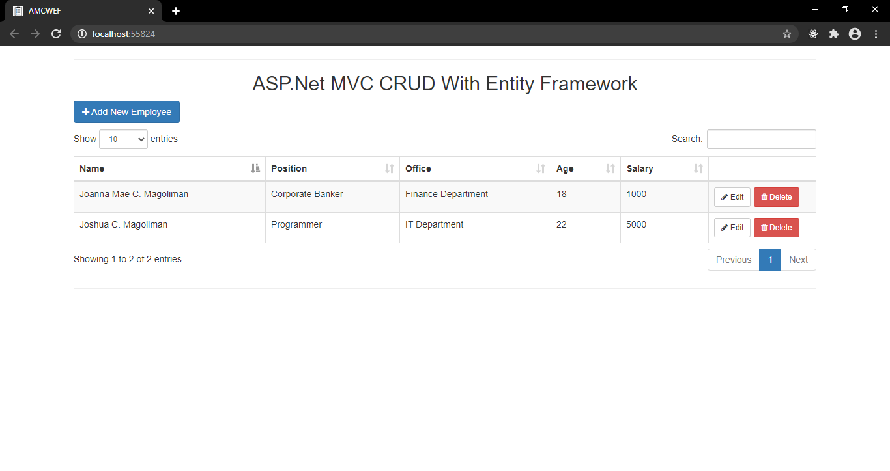

# ASP.NET MVC CRUD WITH ENTITY FRAMEWORK

* Purpose: My Project
* Used IDE: MS Visual Studio 2019
* Target Framework: .Net Framework 4.7.2
* Web Application Framework: ASP.Net
* ASP.Net Programming Models: MVC (version 5.1.1)
* Front End: HTML5, CSS3, JavaScript, AJAX, Bootstrap 3.3.7, jQuery 1.12.4, Data Tables 1.10.15
* Back End: C#, Entity Framework 6.0.0, MS SQL Server 2017
* Responsive Web Design: Yes
* Type of Website: Dynamic

<h2> User Interface Screenshot </h2> 
  
    